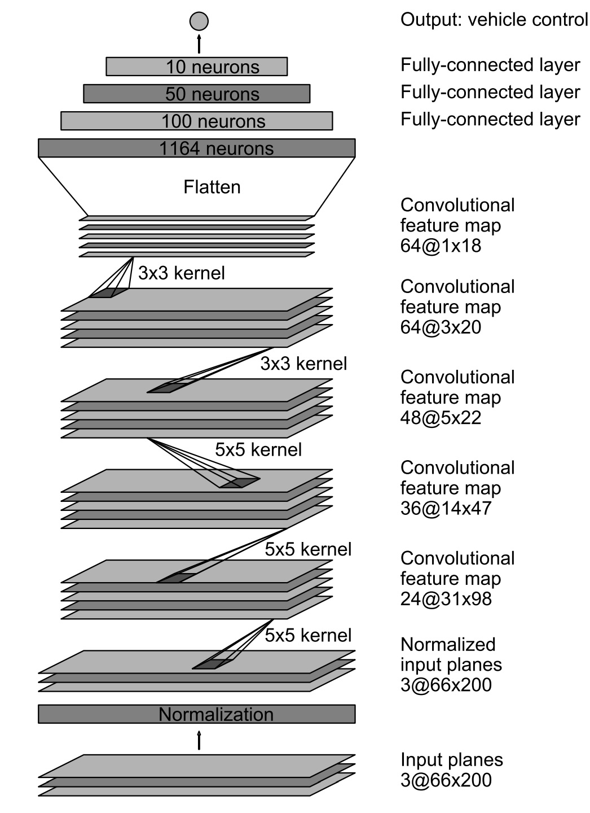

# **Behavioral Cloning** 

Introduction:

In this project, I used what I've learned about deep neural networks and convolutional neural networks to clone driving behavior. 
I trained, validated and tested a model using Keras. The model outputs a steering angle to an autonomous vehicle.
I used a simulator where you can steer a car around a track for data collection. 

I collected both image data and steering angles to train a neural network and then use this model to drive the car autonomously around the track.

---

**Behavioral Cloning Project**

The goals / steps of this project are the following:
* Use the simulator to collect data of good driving behavior
* Build, a convolution neural network in Keras that predicts steering angles from images
* Train and validate the model with a training and validation set
* Test that the model successfully drives around track one without leaving the road
* Summarize the results with a written report

**Use the simulator to collect data of good driving behavior**

I run the Udacity simluator to record good driving data used to train the model. 
When driving I first went around the track 5 times in one recording then 4 times in a separate recording and snitched them together. 
Out of these 9 times I made sure I was staying within the road and in some instances I moved to the left and right side of the road then recentered to the center to demonstrate recovery to the neural network.
This process was then repeated for the left camera then the right camera teaching the neural network different viewpoints and how to recovery.

The dataset consists of 22134 images:
- 7377 Center Camera Image, 
- 7370 left Camera Image 
- 7387 Right Camera Image angle

The training track contains a lot of shallow turns and straight road segments. Hence, the majority of the recorded steering angles are zeros. Therefore, preprocessing images and respective steering angles are necessary in order to generalize the training model for unseen tracks such as our validation track.
[//]: # (Image References)

[image1]:  Wu_images/nvidia_model.jpg 
[image2]:  Wu_images/center_2016_12_01_13_31_14_602.jpg "Center Camera Image"   
[image3]:  Wu_images/center_2016_12_01_13_41_30_388.jpg  "Recovery Image"
[image4]:  Wu_images/center_2016_12_01_13_41_30_490.jpg  "Recovery Image"
[image5]:  Wu_images/center_2016_12_01_13_41_30_591.jpg  "Recovery Image"
[image6]:  Wu_images/center_2016_12_01_13_41_30_591.jpg  "Recovery Image"
[image7]:  Wu_images/center_2016_12_01_13_41_30_794.jpg  "Recovery Image"
[image8]:  Wu_images/center_2016_12_01_13_41_30_894.jpg  "Recovery Image"
[image9]:  Wu_images/center_2016_12_01_13_41_30_996.jpg  "Recovery Image"
[image10]: Wu_images/center_2016_12_01_13_31_14_602.jpg  "Normal Image Before being flipped"
[image11]: examples/flipped_image.jpg "Flipped Image"

**Build, a convolution neural network in Keras that predicts steering angles from images**
**Neural Network Archectiture**

| Layer(type)       | Output Shape        |# Of Parameters
| ------------------| --------------------|----------
| Lambda            | (160, 320, 3)       | 0
| Cropping2D        | (65, 320, 3)        | 0
| Convolution2D     | (33, 160, 24)       | 1824
| Activation        | (33, 160, 24)       | 0
| Max Pooling2D     | (32, 159, 24)       | 0
| Convolution2D     | (16, 80, 36)        | 21636
| Convolution2D     | (8, 40, 48)         | 43248
| Convolution2D     | (7, 39, 64)         | 27712
| Convolution2D     | (6, 38, 64)         | 36928
| Flatten           | (11840)             | 0
| Dense             | (100)               | 116500
| Dense             | (50)                | 5050
| Dense             | (10)                | 510
| Dense             | (1)                 | 11

### Files Submitted & Code Quality

#### 1. Submission includes all required files and can be used to run the simulator in autonomous mode

My project includes the following files:
* model.py containing the script to create and train the model
* drive.py for driving the car in autonomous mode
* model.h5 containing a trained convolution neural network 
* writeup_report.md or writeup_report.pdf summarizing the results

#### 2. Submission includes functional code

Training is done by executing the following in the Simulator and recording good driving behavior

Model creation is done by running

python model.py

Using the Udacity provided simulator and my drive.py file, the car can be driven autonomously around the track by executing sh

python drive.py model.h5

#### 3. Submission code is usable and readable

The model.py file contains the code for training and saving the convolution neural network. The file shows the pipeline I used for training and validating the model, and it contains comments to explain how the code works.

### Model Architecture and Training Strategy

#### 1. An appropriate model architecture has been employed

My model consists of a convolution neural network with 2x2 filter sizes and depths between 24 and 64 (model.py lines 66-103) 
The model includes RELU layers to introduce nonlinearity (code line 20), and the data is normalized in the model using a Keras lambda layer (code line 71). 

#### 2. Attempts to reduce overfitting in the model

The model contains a Max Pooling layer in order to reduce overfitting observed at the corner after the brdige where the car vay (model.py lines 21). 
The model was trained and validated on different data sets to ensure that the model was not overfitting (code line 10-16). The model was tested by running it through the simulator and ensuring that the vehicle could stay on the track.

#### 3. Model parameter tuning

The model used an adam optimizer, so the learning rate was not tuned manually (model.py line 25).

#### 4. Appropriate training data

Training data was chosen to keep the vehicle driving on the road. I used a combination of center lane driving, recovering from the left and right sides of the road. I also included right and left camera angle images from driving around the whole track several times. 
For details about how I created the training data, see the next section. 

### Model Architecture and Training Strategy

#### 1. Solution Design Approach

The overall strategy for deriving a model architecture was to start with the Nvidia's "End to End Learning for Self-Driving Cars" model. 

**Nvidia's Neural Network**

### Model Architecture and Training Strategy

#### 1. Solution Design Approach

The overall strategy for deriving a model architecture was to start with the Nvidia's "End to End Learning for Self-Driving Cars" model. 

**Nvidia's Neural Network**

I thought this model might be appropriate because this model is used to map raw pixels from a single front-facing camera directly to steering commands, this is similar to what I hoped to achieve.
In order to gauge how well the model was working, I split my image and steering angle data into a training and validation set. I found that my first model had a low mean squared error on the training set but a high mean squared error on the validation set. This implied that the model was overfitting. 
To combat the overfitting, I modified the model so that Max Pooling is done at the beginning of the model.
The final step was to run the simulator to see how well the car was driving around track one. There were a few spots where the vehicle fell off the track, to improve the driving behavior in these cases, by augmenting the images fed to my training network.
At the end of the process, the vehicle is able to drive autonomously around the track without leaving the road.

#### 2. Creation of the Training Set & Training Process

To capture good driving behavior, I first recorded two laps on track one using center lane driving. Here is an example image of center lane driving:

![alt text][image2]

I then recorded the vehicle recovering from the left side and right sides of the road back to center so that the vehicle would learn to .... These images show what a recovery looks like starting from ... :

![alt text][image3]
![alt text][image4]
![alt text][image5]
![alt text][image6]
![alt text][image7]
![alt text][image8]
![alt text][image9]

Then I repeated this process on track two in order to get more data points.

To augment the data sat, I also flipped images and angles thinking that this would. For example, here is an image that has then been flipped, this first picture is of this image normal then the second image is of teh same image flipped.:

![alt text][image10]
![alt text][image11]

The Above archectiture turns into:

| Layer(type)       | Output Shape        |# Of Parameters
| ------------------| --------------------|----------
| Lambda            | (160, 320, 3)       | 0
| Cropping2D        | (65, 320, 3)        | 0
| Convolution2D     | (33, 160, 24)       | 1824
| Activation        | (33, 160, 24)       | 0
| Max Pooling2D     | (32, 159, 24)       | 0
| Convolution2D     | (16, 80, 36)        | 21636
| Convolution2D     | (8, 40, 48)         | 43248
| Convolution2D     | (7, 39, 64)         | 27712
| Convolution2D     | (6, 38, 64)         | 36928
| Flatten           | (11840)             | 0
| Dense             | (100)               | 116500
| Dense             | (50)                | 5050
| Dense             | (10)                | 510
| Dense             | (1)                 | 11
| ------------------| --------------------|----------

Total params: 348,219
Trainable params: 348,219
Non-trainable params: 0

After the collection process, I had 38572 samples and validate on 9644. I end up having 348,219 parameters to wortk with. number of data points. 
I then preprocessed this data by adding a lambda layer and cropping parts of the image that do not include the road.
I finally randomly shuffled the data set and put Y% of the data into a validation set. 
I used this training data for training the model. The validation set helped determine if the model was over or under fitting. The ideal number of epochs was 5 as evidenced by  validation loss not improving after 5 epoch.
I used an adam optimizer so that manually training the learning rate wasn't necessary.

The video of my run in can be found at [Video of Autonomous Drive](run1.mp4) 

